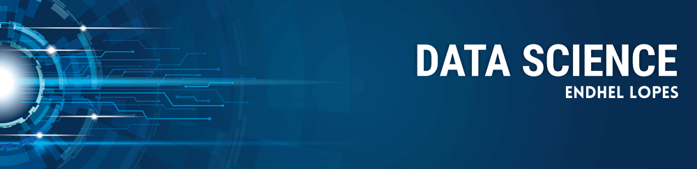

   

  

# Endhel Lopes de Freitas - Portfólio

*Graduate in Information Systems* at the Federal University of Ouro Preto

As a data scientist, I'm always looking for problems to solve. This fascinating area of artificial intelligence makes me excited to overcome obstacles. With each passing day, I am more aware that in data science there is always something more to learn. This data science personal project portfolio is to demonstrate my skills in solving business challenges through my knowledge and tools of Data Science.

**Analytical Tools:**

**Data Collect and Storage:** SQL, MySQL, SQLite. Flask-sqlachemy.

**Data Processing and Analysis:** Python.

**Development:** Git, Flask.

**Machine Learning Modeling:** Classification, Regression, Clustering, Time Series.

**Machine Learning Deployment:** Heroku.

  

## Contact :mailbox_with_no_mail::

  
 

## Data Science Projects:

### [Rossmann - Sales Forescast Project](https://github.com/endhel/Rossmann-Store-Sales-Forecasting)
Building a Machine Learning Model to sales  is a common and essential use in data science.  

In this project, i developed a Machine Learning model able to forescat sales with **Mean Absolute Percentage error accuracy(MAPE): 0.14 +/- 0.02**.
The performance of this model would increase **revenue of R$5 millions** according to the company's business model described in the problem definition.

### [InvestBot - a bot for classifying stocks on the stock exchange using data mining techniques](https://github.com/endhel/InvestBot)
Learning to rank (LTR) is a class of algorithmic techniques that apply supervised machine learning to solve ranking problems in search relevancy. In other words, it’s what orders query results.

In this project, i developed a model able to predict the probability of a customer purchasing vehicle insurance . In this way, ranking customers from the most likely to purchase to the least likely.

With 20.000 calls made to a new set of 127.000 customers, the perfomance of this model with **Recall at 20000:  0.81** would increase **annual revenue of R$2.4 millions** according to the company's business model described in the problem definition.

## Data Analysis - Insight Projets

### [House Rocket - Insights Project]()
Knowing how to analyze and explore data is critical knowledge for a data scientist.

In this project, through exploration, analysis and data visualization tools, I created insights for the company and in the end recommended the purchase of 20 properties resulting in **revenue of R$9 millions** according to the company's business model described in the problem definition.

